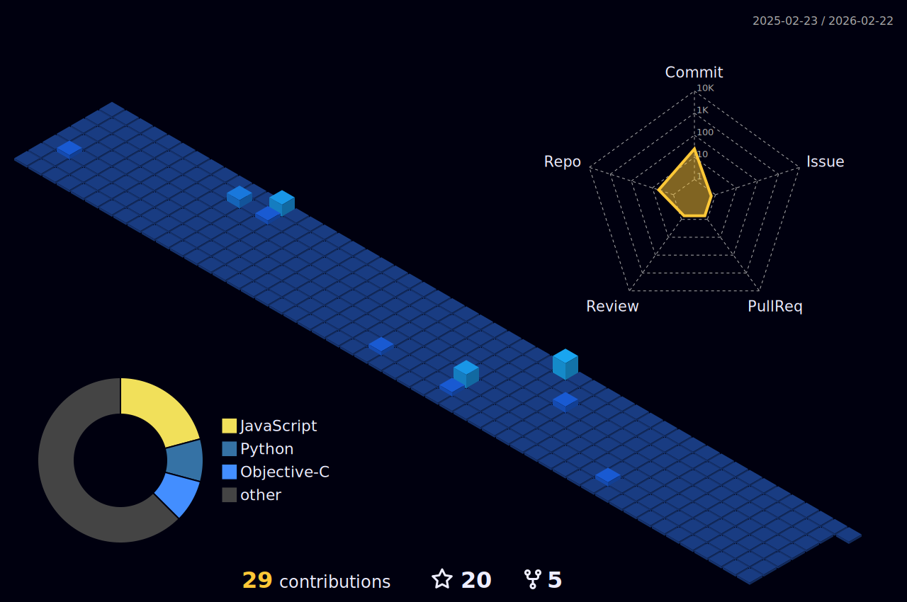

# Hey,  how is it going ?  ᕕ( ᐛ ) ᕗ

Hello, my name is Henrique Marques, i'm a iOS developer who loves music and programming, i mean, just when xcode doesn't crashes haha, kidding.

Currently, i'm on the 100 days of swift challenge with the objective to improve my swift skills.

Link: https://www.hackingwithswift.com/100

<h3>My Github Stats:</h3>

  

    
  

  

<h3 align="left"> Programming Language and Tools I use in my projects:</h3>

  
  
  
   
  
  

  
<h3>Programming Portfolio and iOS UI Design:</h3>
    
    
  
 
  PS: If you want to see some app icons or mini Ui projects that i've done check the Google Drive icon. I keep it there for those who don't have a Sketch account  ˙ ͜ʟ˙
 <h3>Connect with me:</h3>
  
 
   
  
  

  
